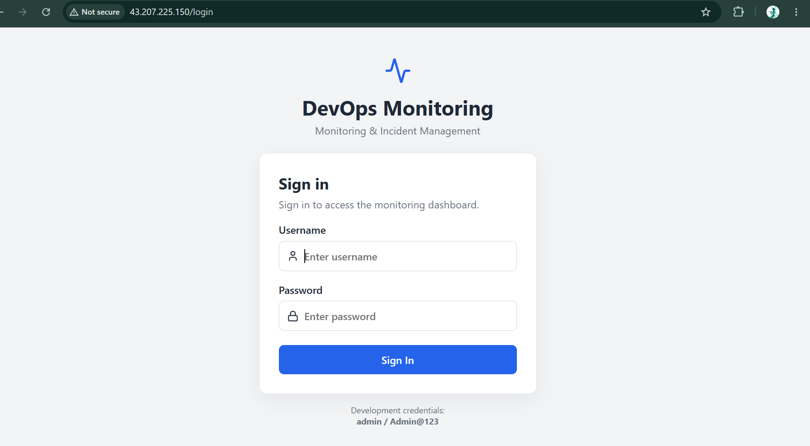
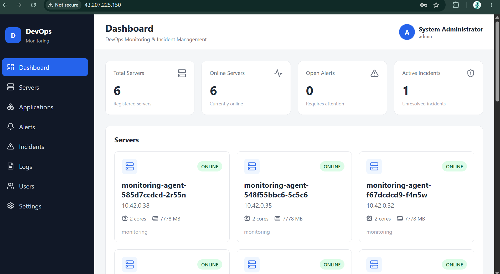
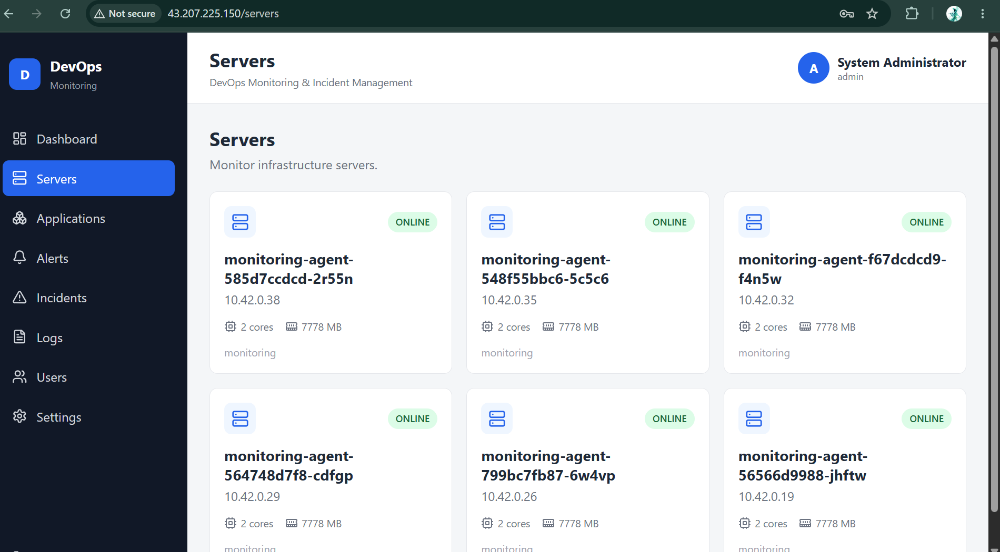
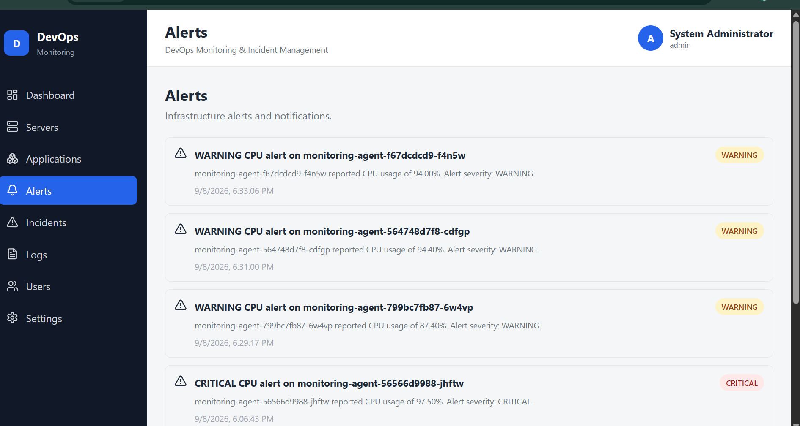
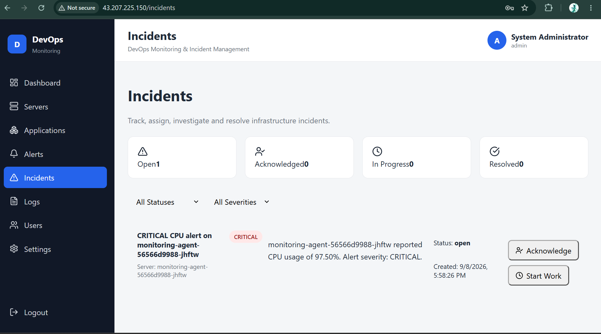
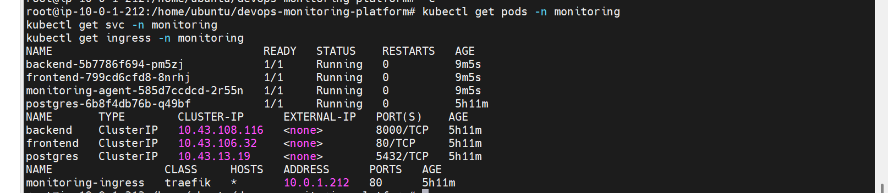
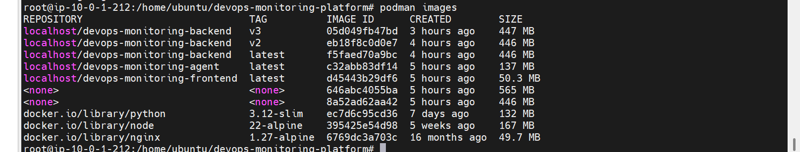
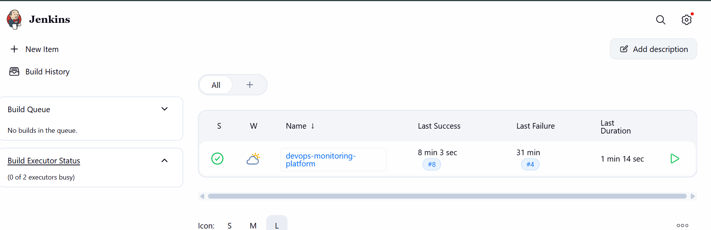

# DevOps Monitoring Platform

## Project Details

The **DevOps Monitoring Platform** is a web-based platform for monitoring and managing DevOps infrastructure.

It provides a centralized dashboard for:

* User Login
* Server Monitoring
* Alerts
* Incident Management
* Kubernetes Monitoring
* Podman Container Monitoring
* Jenkins CI/CD Monitoring

### Main Technologies

* React
* FastAPI
* PostgreSQL
* Python
* Docker
* Podman
* Kubernetes / k3s
* Jenkins
* Prometheus
* Grafana
* Trivy
* AWS
* Linux
* Git & GitHub

---

## Project Structure

```text
devops-monitoring-platform/
│
├── frontend/
│   ├── public/
│   │   ├── favicon.ico
│   │   └── index.html
│   │
│   ├── src/
│   │   ├── assets/
│   │   │   └── logo.svg
│   │   │
│   │   ├── components/
│   │   │   ├── Sidebar.jsx
│   │   │   ├── Header.jsx
│   │   │   ├── StatCard.jsx
│   │   │   ├── ServerCard.jsx
│   │   │   ├── AlertCard.jsx
│   │   │   ├── IncidentCard.jsx
│   │   │   ├── MetricChart.jsx
│   │   │   ├── StatusBadge.jsx
│   │   │   ├── LoadingSpinner.jsx
│   │   │   ├── ErrorMessage.jsx
│   │   │   └── ProtectedRoute.jsx
│   │   │
│   │   ├── pages/
│   │   │   ├── Login.jsx
│   │   │   ├── Dashboard.jsx
│   │   │   ├── Servers.jsx
│   │   │   ├── ServerDetails.jsx
│   │   │   ├── Applications.jsx
│   │   │   ├── Alerts.jsx
│   │   │   ├── Incidents.jsx
│   │   │   ├── Logs.jsx
│   │   │   ├── Users.jsx
│   │   │   └── Settings.jsx
│   │   │
│   │   ├── services/
│   │   │   └── api.js
│   │   │
│   │   ├── context/
│   │   │   └── AuthContext.jsx
│   │   │
│   │   ├── hooks/
│   │   │   ├── useAuth.js
│   │   │   ├── useFetch.js
│   │   │   └── useMonitoring.js
│   │   │
│   │   ├── utils/
│   │   │   ├── constants.js
│   │   │   ├── formatters.js
│   │   │   └── validators.js
│   │   │
│   │   ├── styles/
│   │   │   ├── global.css
│   │   │   ├── dashboard.css
│   │   │   └── responsive.css
│   │   │
│   │   ├── App.jsx
│   │   └── main.jsx
│   │
│   ├── package.json
│   ├── package-lock.json
│   ├── vite.config.js
│   ├── index.html
│   └── Containerfile
│
├── backend/
│   │
│   ├── app/
│   │   ├── __init__.py
│   │   ├── main.py
│   │   │
│   │   ├── api/
│   │   │   ├── __init__.py
│   │   │   ├── auth.py
│   │   │   ├── servers.py
│   │   │   ├── metrics.py
│   │   │   ├── alerts.py
│   │   │   ├── incidents.py
│   │   │   ├── applications.py
│   │   │   └── logs.py
│   │   │
│   │   ├── models/
│   │   │   ├── __init__.py
│   │   │   ├── user.py
│   │   │   ├── server.py
│   │   │   ├── metric.py
│   │   │   ├── alert.py
│   │   │   ├── incident.py
│   │   │   ├── application.py
│   │   │   └── log.py
│   │   │
│   │   ├── schemas/
│   │   │   ├── __init__.py
│   │   │   ├── user.py
│   │   │   ├── server.py
│   │   │   ├── metric.py
│   │   │   ├── alert.py
│   │   │   ├── incident.py
│   │   │   ├── application.py
│   │   │   └── log.py
│   │   │
│   │   ├── services/
│   │   │   ├── __init__.py
│   │   │   ├── monitoring.py
│   │   │   ├── alert_engine.py
│   │   │   ├── incident_service.py
│   │   │   └── health_service.py
│   │   │
│   │   ├── database/
│   │   │   ├── __init__.py
│   │   │   ├── connection.py
│   │   │   ├── init_db.py
│   │   │   └── seed.py
│   │   │
│   │   └── core/
│   │       ├── __init__.py
│   │       ├── config.py
│   │       ├── security.py
│   │       └── dependencies.py
│   │
│   ├── tests/
│   │   ├── __init__.py
│   │   ├── test_auth.py
│   │   ├── test_servers.py
│   │   ├── test_metrics.py
│   │   ├── test_alerts.py
│   │   └── test_incidents.py
│   │
│   ├── requirements.txt
│   ├── requirements-dev.txt
│   └── Containerfile
│
├── agent/
│   ├── agent.py
│   ├── config.py
│   ├── requirements.txt
│   ├── Containerfile
│   └── README.md
│
├── database/
│   ├── init.sql
│   ├── schema.sql
│   └── seed.sql
│
├── deployment/
│   │
│   ├── kubernetes/
│   │   ├── namespace.yaml
│   │   ├── configmap.yaml
│   │   ├── secret.yaml
│   │   ├── postgres.yaml
│   │   ├── backend.yaml
│   │   ├── frontend.yaml
│   │   ├── agent.yaml
│   │   ├── services.yaml
│   │   └── ingress.yaml
│   │
│   └── aws/
│       ├── README.md
│       ├── architecture.md
│       └── ec2-setup.sh
│
├── tests/
│   ├── backend/
│   │   ├── test_auth.py
│   │   ├── test_servers.py
│   │   ├── test_metrics.py
│   │   ├── test_alerts.py
│   │   └── test_incidents.py
│   │
│   ├── frontend/
│   │   ├── Dashboard.test.jsx
│   │   ├── Login.test.jsx
│   │   └── Servers.test.jsx
│   │
│   └── integration/
│       └── test_api.py
│
├── scripts/
│   ├── setup.sh
│   ├── health-check.sh
│   ├── start.sh
│   └── stop.sh
│
├── podman-compose.yml
│
├── .env.example
├── .gitignore
├── .dockerignore
├── Jenkinsfile
├── README.md
└── LICENSEs
```

---

## Kubernetes

Kubernetes is used to deploy and manage the application containers.

### Kubernetes Components

* Namespace
* Pods
* Deployments
* Services
* ConfigMaps
* Secrets
* Ingress
* Health Checks

### Kubernetes Commands

```bash
kubectl get nodes
```

```bash
kubectl get pods -A
```

```bash
kubectl get deployments -A
```

```bash
kubectl get services -A
```

```bash
kubectl get pods -n monitoring
```

---

## Jenkins

Jenkins is used for continuous integration and continuous deployment.

### Jenkins Pipeline

```text
GitHub
   ↓
Jenkins
   ↓
Checkout
   ↓
Build
   ↓
Test
   ↓
Docker / Podman Build
   ↓
Trivy Scan
   ↓
Container Registry
   ↓
Kubernetes Deployment
   ↓
Health Check
```

### Jenkins Stages

* Checkout
* Build
* Test
* Container Build
* Security Scan
* Push Image
* Kubernetes Deployment
* Health Check

---

## Podman

Podman is used for container image and container management.

### Podman Commands

Check version:

```bash
podman --version
```

List images:

```bash
podman images
```

List containers:

```bash
podman ps
```

List all containers:

```bash
podman ps -a
```

Build image:

```bash
podman build -t devops-monitoring-backend .
```

Run container:

```bash
podman run -d devops-monitoring-backend
```

View logs:

```bash
podman logs <container-id>
```

---

## Docker

Docker is used for application containerization.

```bash
docker build -t devops-monitoring-backend ./backend
```

```bash
docker build -t devops-monitoring-frontend ./frontend
```

Run the application:

```bash
docker compose up -d --build
```

---

## Monitoring

The project uses monitoring tools to collect and visualize infrastructure information.

### Prometheus

Used for collecting metrics.

### Grafana

Used for monitoring dashboards and visualization.

---

## Alerts

The platform provides alerts for infrastructure and application problems.

Examples:

* High CPU usage
* High memory usage
* High disk usage
* Server down
* Kubernetes pod failure
* Application failure

---

## Incidents

The platform provides incident management for handling infrastructure and application problems.

```text
Alert
  ↓
Incident
  ↓
Investigation
  ↓
Resolution
  ↓
Closed
```

---

## Server Monitoring

The platform provides server monitoring information including:

* Server status
* CPU usage
* Memory usage
* Disk usage
* Uptime
* Server health

---

## CI/CD

The complete CI/CD workflow is:

```text
Developer
    ↓
GitHub
    ↓
Jenkins
    ↓
Build
    ↓
Test
    ↓
Podman / Docker
    ↓
Trivy
    ↓
Container Registry
    ↓
Kubernetes
    ↓
Application
```

---

## Security

Security tools and practices used in the project:

* Trivy container scanning
* Kubernetes Secrets
* Environment variables
* AWS IAM
* Security Groups
* Secure container images
* Linux security

---

## AWS

The project can be deployed on AWS using:

* EC2
* VPC
* Subnets
* Route Tables
* Security Groups
* IAM
* ECR
* Load Balancer

---

## Screenshots

### Login



### Dashboard



### Server



### Alert



### Incident



### KubernetesPods



### PodmanImages



### Jenkins


### JenkinsPipeline


---

## Project Workflow

```text
Login
  ↓
Dashboard
  ↓
Servers
  ↓
Alerts
  ↓
Incidents
  ↓
Kubernetes
  ↓
Podman
  ↓
Jenkins
  ↓
Monitoring
```

---

## Author

**Venu Jaganti**

DevOps / Cloud Engineer
